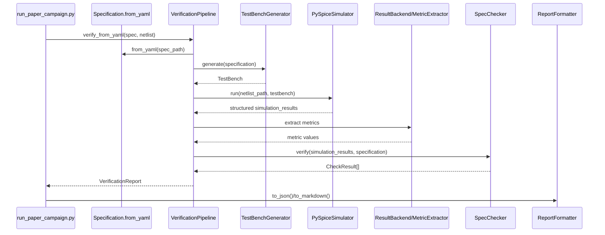

# Phase 3 - End-to-End Case Walkthrough (`p04_amplifier`)

## Case selected

- Specification: `examples/benchmark_specs/p04_amplifier.yaml`
- Netlist: `benchmark/analogcoder_pro/p04_amplifier.cir`
- Artifact run: `artifacts/paper_campaign/20260711_094959/p04_amplifier/`

## Observed outcome

- `simulation_mode`: `REAL`
- `execution_status`: `SUCCESS`
- `compliance_status`: `FAIL`
- `scientific_category`: `SIMULABLE_NONCOMPLIANT`
- Failing metric: `dc_gain_db`

This is confirmed by:

- `artifacts/paper_campaign/20260711_094959/p04_amplifier/report.json`
- `artifacts/paper_campaign/20260711_094959/p04_amplifier/provenance.json`
- `results/paper_campaign_summary.json`

## Step-by-step trace

1. Initial spec file
   - Source: `examples/benchmark_specs/p04_amplifier.yaml`
   - Inputs: YAML fields `name`, `circuit_type`, `performance_targets`, `input_conditions`, `test_categories`
   - Output: structured YAML text on disk

2. YAML parsing
   - Source code: `Specification.from_yaml()` in `spec2testbench/domain/entities/specification.py`
   - Output: `Specification(name="analogcoder_pro_p04_amplifier", circuit_type=AMPLIFIER, ...)`

3. Normalization
   - `performance_targets` normalized by `_normalize_performance_targets()`
   - numeric fields coerced by `_coerce_numeric()`
   - `input_nodes` and `output_nodes` normalized lazily by property getters

4. Requirement creation
   - Requirements are not represented as a dedicated `Requirement` entity.
   - Real representation is `Specification.performance_targets: Dict[str, Any]`.
   - For this case:
     - `operating_point`
     - `dc_gain_db`
     - `quiescent_current`

5. Analysis selection
   - Source code: `TestBenchGenerator._determine_categories()`
   - Because `test_categories` is explicitly provided, categories become `dc`, `ac`, `transient`.

6. Stimulus generation
   - `dc`: DC source around common-mode voltage.
   - `ac`: AC source with magnitude 1.
   - `transient`: pulse source.
   - Observed final generated deck in artifact:
     - `Vvin Vin 0 2.5`
     - `Vvin Vin 0 AC 1`
   - Interpretation:
     - the final persisted artifact shows only the merged DC and AC stimuli for this simple case.

7. Load insertion
   - No explicit synthetic load insertion is visible in the persisted `testbench.cir` for `p04`.
   - Load behavior is mostly delegated to the included circuit netlist unless the template path creates a load stimulus elsewhere.

8. Observed nodes
   - Spec declares `input_nodes: Vin, Vbias`
   - Spec declares `output_nodes: Vout`
   - Generator uses `_primary_input_node()` and `_primary_output_node()`, so the first listed nodes dominate default planning.

9. Measurement command generation
   - The `TestBench` abstraction supports `.MEASURE`, but the artifact `testbench.cir` for `p04` contains no explicit `.MEASURE` lines.
   - This strongly suggests the real simulator path constructs measurement commands elsewhere or relies on raw/native backend extraction rather than this persisted deck alone.

10. Final testbench assembly
   - Artifact file: `artifacts/paper_campaign/20260711_094959/p04_amplifier/testbench.cir`
   - Contents observed:
     - `.INCLUDE ...p04_amplifier.cir`
     - `Vvin Vin 0 2.5`
     - `Vvin Vin 0 AC 1`
     - `.OP`
     - `.AC dec 10 1 1000000000.0`

11. ngspice command
   - Artifact `ngspice_command.txt` contains only:
   - `ngspice -b -r <raw_file> testbench.cir`
   - Fact observed:
     - the artifact stores a canonicalized placeholder command string, not the exact full command with resolved temp paths.

12. Temporary/output files
   - Stored outputs:
     - `stdout.txt`
     - `stderr.txt`
     - `metrics.json`
     - `provenance.json`
     - reports
   - No raw waveform file is persisted in the paper-campaign artifact folder for this case.

13. Result parsing
   - Source code: `PySpiceSimulator.run(...)` plus backend extraction adapters in `result_backends.py`.
   - Higher-level access path: `MetricExtractor.extract(...)`.

14. Metric calculation
   - `operating_point`: extracted from DC-like structures or direct metrics.
   - `dc_gain_db`: extracted from AC data or direct backend metric.
   - `quiescent_current`: extracted from supply current/current containers.

15. Unit normalization
   - Source code: `SpecChecker._to_si()`
   - For `V`, `dB`, `A`, units are either converted to SI or treated as already normalized.

16. Threshold application
   - `operating_point`: checked against `[0, 5] V`
   - `dc_gain_db`: checked against `>= 0 dB`
   - `quiescent_current`: checked against `<= 0.05 A`

17. `ComplianceStatus` creation
   - `dc_gain_db` fails with `-160 dB < 0 dB`
   - therefore nominal compliance becomes `FAIL`

18. Other statuses
   - `ExecutionStatus.SUCCESS`
   - `SimulationMode.REAL`
   - `RobustnessStatus.NOT_EVALUATED`
   - `ScientificCategory.SIMULABLE_NONCOMPLIANT`

19. Scientific eligibility
   - `eligible_for_paper_results` is `true`
   - Important: eligibility is not the same thing as compliance. This case is eligible and noncompliant.

20. Generated evidence
   - `metrics.json`
   - `provenance.json`
   - `report.json`
   - `report.md`
   - copied spec and netlist
   - generated testbench

## Mermaid sequence

## Architectural reading

Fact observed:
- `p04_amplifier` is the single canonical noncompliant case in `results/paper_campaign_summary.json`.

Interpretation:
- the framework is not only classifying “simulable” but genuinely distinguishing compliant from noncompliant evidence.
