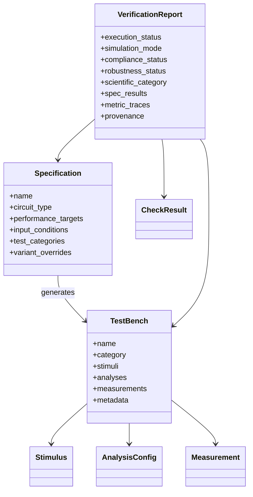

# Phase 4 - Domain Model

## Core observed concepts

## `Specification`

- Representation: dataclass in `spec2testbench/domain/entities/specification.py`
- Fields:
  - `name`
  - `circuit_type`
  - `performance_targets`
  - `input_conditions`
  - `test_categories`
  - `process_corners`
  - `temperature_range`
  - `supply_variation`
  - `technology`
  - `description`
  - `raw_specs`
  - `case_id`
  - `parent_circuit_id`
  - `variant_overrides`
  - `measurement`
- Invariants:
  - name length >= 2
  - `vdd > 0`
  - `load_capacitance > 0`
  - `0 <= supply_variation <= 1`
  - if both present, metric `min < max`
- Created in:
  - `from_yaml`, `from_dict`, `from_text`
- Modified in:
  - mostly immutable by convention, but fields are mutable dataclass state
- Serialized in:
  - `to_yaml`, `to_dict`
- Duplication:
  - metric semantics are embedded as dicts, not dedicated value objects

## `VariantOverride`

- Representation: dataclass in `specification.py`
- Role: controlled-violation mutation propagation into transient analysis parameters

## `TestBench`

- Representation: dataclass in `spec2testbench/domain/entities/testbench.py`
- Fields:
  - `name`, `category`, `circuit_name`, `case_id`, `netlist_path`
  - `stimuli`, `analyses`, `measurements`
  - `pyspice_code`, `description`, `temperature`, `metadata`
- Created in:
  - `TestBenchGenerator`
- Modified in:
  - generator merge/deduplication, pipeline metadata injection
- Serialized in:
  - `generate_spice_deck`, `generate_pyspice_code`, `to_dict`

## `Stimulus`

- Representation: dataclass
- Role: input source description with SPICE/PySpice renderers

## `AnalysisConfig`

- Representation: dataclass
- Role: analysis planning for `dc`, `ac`, `tran`, `fourier`, `pvt`, etc.

## `Measurement`

- Representation: dataclass
- Role: planned metric extraction request with thresholds and unit metadata

## `CheckResult`

- Representation: dataclass in `domain/value_objects/verdict.py`
- Role: metric-level verification outcome
- Fields:
  - `test_name`, `verdict`, `measured_value`, `expected_min`, `expected_max`, `unit`, `message`, `category`, `waveform_path`, `diagnostics`

## `VerificationReport`

- Representation: dataclass in `application/usecases/run_verification.py`
- Role: aggregate execution/reporting/evidence object
- Important fields:
  - execution metadata
  - statuses
  - `spec_results`
  - `metric_traces`
  - logs/errors
  - provenance
  - measurement backend/source status

## Status model

- `Verdict`
  - metric-level PASS/WARNING/FAIL/ERROR/N/A
- `ValidationStatus`
  - run-level PASS/FAIL/RUN/ROBUST PASS
- `ExecutionStatus`
  - `SUCCESS`, `ERROR`, `TIMEOUT`, `SKIPPED`
- `SimulationMode`
  - `REAL`, `MOCK`, `RECOVERED`
- `ComplianceStatus`
  - `PASS`, `FAIL`, `NOT_EVALUATED`
- `RobustnessStatus`
  - `ROBUST_PASS`, `ROBUST_FAIL`, `NOT_EVALUATED`
- `ScientificCategory`
  - `SIMULABLE_COMPLIANT`, `SIMULABLE_NONCOMPLIANT`, `NON_SIMULABLE`, `UNEVALUATED`

## Missing or weakly modeled concepts

The following requested business concepts are not first-class classes:

- requirement
- metric definition
- threshold
- assertion
- provenance
- report
- evidence artifact
- execution result

They exist, but mostly as:

- dictionaries
- enum/value-object fields
- dataclass fields inside `VerificationReport`
- ad hoc JSON structures

## Domain diagram

## Architectural reading

Fact observed:
- The domain model exists, but a large part of the business vocabulary is still encoded as nested dictionaries rather than explicit classes.

Interpretation:
- This makes the model flexible for experiments, but weaker for long-term maintainability and refactoring safety.
